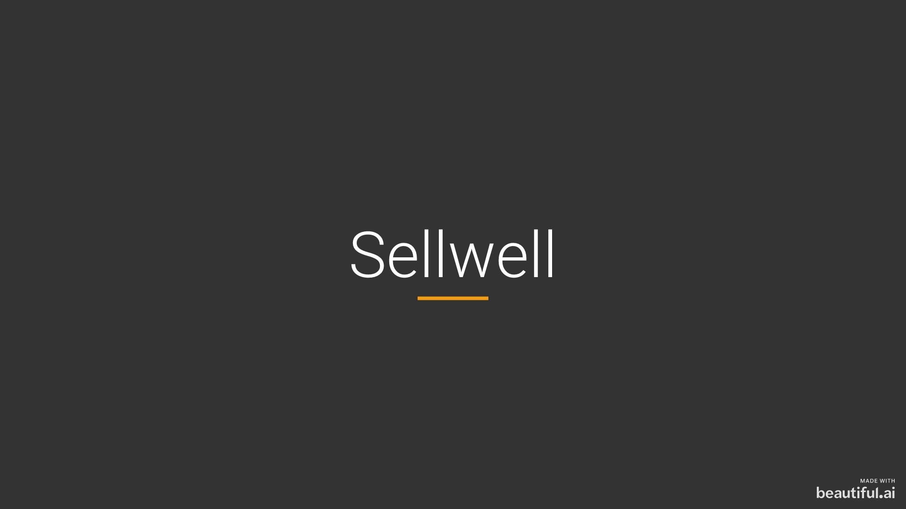

<h1 align="center">Sellwell</h1>

A simple CRM that helps freelancers track and organize their sales process

<a href="https://www.beautiful.ai/player/-M7cwadhXFOa1WvCQpIc" target="_blank">View Sellwell Presentation</a>

## Rationale

- Most customer relationship management (CRM) software is built for large businesses
- CRMs include dozens of features that freelancers and solo consultants do not need
- Excess features create a cluttered UI that leads to lower user adoption and satisfaction
- Sellwell provides just enough functionality to make the sales process easy and efficient for freelancers and solo consultants
- This is the CRM I wish I had when I was freelancing

## Technology Stack

### Frontend
- [React](https://reactjs.org/)
- [React Router](https://reacttraining.com/react-router/)
- [Material-UI](https://material-ui.com/)
- [material-table](https://material-table.com/)
- [react-trello](https://github.com/rcdexta/react-trello)

### Backend
- [Repo for backend](https://github.com/lukewaring/sellwell-api)
- [Ruby on Rails](https://rubyonrails.org/)
- [Faker](https://github.com/faker-ruby/faker)

## User Stories

- Create, edit and delete:
    - Accounts, contacts, opportunities and activities
- View show pages for all resources
- View a summary of opportunities (kanban-style)
    - Organized by stage (new, follow-up, negotiations, won)
- View opportunities and related details (spreadsheet-style)
    - Organized by date, value, company, priority

## Contributing

Contributions are what make the open source community such an great place to learn, inspire, and create. Any contributions you make are **greatly appreciated**.

1. Fork the Project
2. Create your Feature Branch (`git checkout -b feature/new-feature`)
3. Commit your Changes (`git commit -m 'Add some new-feature'`)
4. Push to the Branch (`git push origin feature/new-feature`)
5. Open a Pull Request

## Contact

Luke Waring - [@luke_waring](https://twitter.com/luke_waring)

Project Link: [https://github.com/lukewaring/sellwell-client](https://github.com/lukewaring/sellwell-client)
